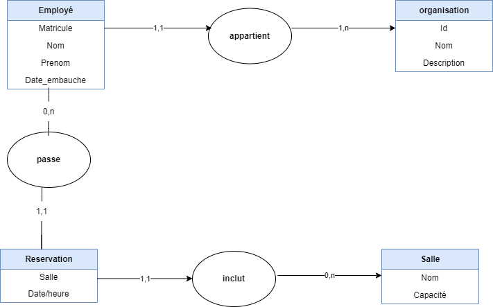

# springboot-training API REST

__Environnement__

* base de données MYSQL
* langage : JAVA
* version : 17
* version springboot : 3.0.0-SNAPSHOT
* version DBUnit : 2.7.0

L'application/*web services* gère des employés rattachés à une organisation. Nous pouvons gérer des meetings room en prenant en compte une salle et un responsable.

Ci-dessous, le modèle conceptuel de donnée représentant les différentes entités.

## Le service

### Les entités

Il y a 4 entités / __Business Object__:

- Salle
- Organisation
- Employe
- Reservation

Ces classes héritent d'une classe parente *SuperBO* qui ne contient que les colonnes techniques (creationDate, createdBy, updateDate, updatedBy, techLock) ainsi que les methodes prePersist, preUpdate qui récupère les informations de l'utilisateur *ThreatLocal* initiant l'opération.

### Data Transfer Object / DTO

Chaque entité possède un Data Transfer Object qui reprend la classe entité sans les colonnes techniques :

- Salle
- Organisation
- Employe
- Reservation,

### Mapper

Des classes *mapper* afin de passer de BO à DTO et vice-versa:

- SalleMapper
- OrganisationMapper
- EmployeMapper
- ReservationMapper,

### Services

Un service pour chaque entité :

- SalleService
- OrganisationService
- EmployeService
- ReservationService,

### Controllers

Pour finir, un controller pour chaque service/entité :

- SalleController
- OrganisationController
- EmployeController
- ReservationController,

## les Tests

Ce projet springboot a été testé avec DBUnit. On a effectué des tests unitaires sur les packages service et controller. DBUnit permet de mettre en place un jeu de donnée (un exemple de la basse de données juste pour les tests) est injecté lors de l'exécution à partir d'annotation. On vérifie le résultat et compare avec le résultat attendu afin d'attester du bon comportement de l'application.

### services

- SalleServiceTest
- OrganisationServiceTest
- EmployeServiceTest
- ReservationServiceTest,

### Controllers

- SalleControllerTest
- OrganisationControllerTest
- EmployeControllerTest
- ReservationControllerTest,

Une couverture de test à hauteur de 70 % prouve que les classes ont été bien testées, notamment en testant des cas passant et non-passant. Ce qui m'a permis d'améliorer l'application en rajoutant des fonctionnalités et des exceptions personnalisés.

## Docker

La suite de l'exercice a été de conteneuriser l'application en une image docker. J'ai suivi une formation à cet effet.

## Kubernetes

Une formation sur Kubernetes en complément afin de déployer l'image sur un cluster local grâce à *minikube*: gestion des replicas, services, etc.
Vous trouverez les fichiers de *deployement* et autre dans `./training/kubernetes`.

* déploiement de deux conteneurs training et MYSQL
* déploiement d'un conteneur se connectant à un MYSQL local

## Conclusion

J'ai beaucoup appris lors de cette formation notamment la partie test unitaire, docker et Kubernetes, me permettant de monter en compétences DEVOPS. Ce fut utile pour les projets qui ont suivi et qui suivront. ;)
